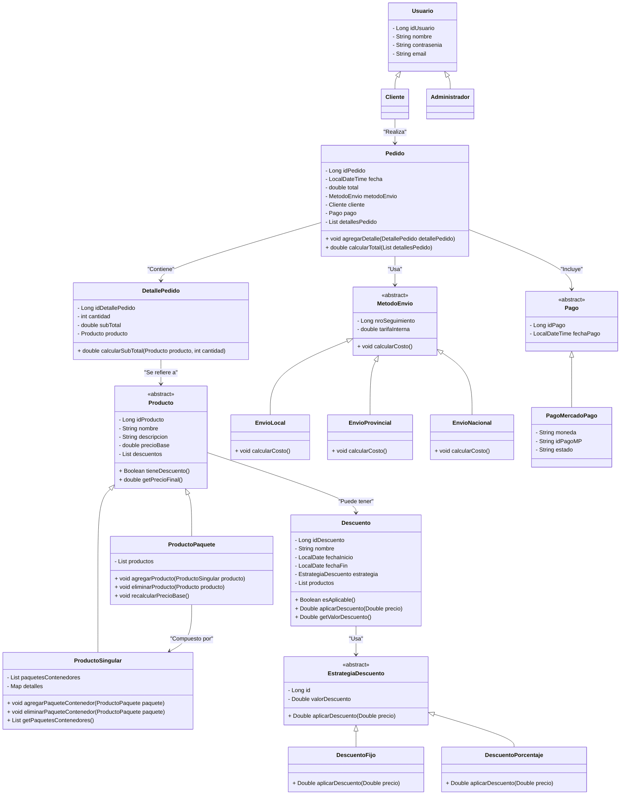

# Trabajo en Equipo

**Erreguerena, Agustín Iñaki:** Responsable del diseño de pantallas, implementación de plantillas, integración con la API de Mercado Pago y apoyo en el modelado del diagrama de clases.

**Fraga, Facundo Román:** Encargado del diseño de pantallas y soporte en la implementación de las entidades JPA.

**Piloni, Fabrizio Julián:** Responsable de la creación del diagrama de clases y de la implementación de las entidades JPA.

**Pulikoski, Mauricio Ezequiel:** Responsable de las funcionalidades de alta, baja y modificación de productos individuales, diseño e implementación de plantillas, y desarrollo del sistema de registro e inicio de sesión de usuarios.

# Diseño OO

# Wireframe y caso de uso

# Backlog de Iteración 1
### Registrar cuenta

### Alta/Modificación de producto singular

### Carrito

### Detalle de producto

### Error

### Gestión de productos y paquetes

### Iniciar sesión

### Menú administrador

### Menú cliente

### Método de pago - Paso 1

### Método de pago - Paso 2

### Pago exitoso

### Resumen de pedido

# **Backlog de Iteración**

## **Historias de Usuario**

1. **HU01: Crear descuentos en productos**  
   - **Criterios de aceptación**:
     1. Definir un porcentaje o monto fijo de descuento y asociarlo a productos específicos.
     2. Guardar el descuento en la base de datos y aplicarlo automáticamente.
     3. Reflejar el descuento en el precio final visible en la tienda en línea.

2. **HU02: Buscar productos por categorías**  
   - **Criterios de aceptación**:
     1. Permitir al cliente buscar productos por nombre o categoría.
     2. Mostrar solo los productos que coinciden con la búsqueda.
     3. No mostrar productos si no hay coincidencias.

3. **HU03: Ver detalles del pedido antes de confirmar la compra**  
   - **Criterios de aceptación**:
     1. Mostrar un resumen del pedido con precios detallados.
     2. Incluir descuentos y cargos adicionales en el total.
     3. Requerir confirmación antes de procesar el pago.

4. **HU04: Programar la duración de los descuentos**  
   - **Criterios de aceptación**:
     1. Seleccionar fechas de inicio y fin del descuento.
     2. Activar y desactivar automáticamente los descuentos en las fechas especificadas.
     3. Mostrar el precio regular al terminar el descuento.

5. **HU05: Aplicar descuentos automáticamente al agregar productos al carrito**  
   - **Criterios de aceptación**:
     1. Aplicar automáticamente los descuentos al agregar productos al carrito.
     2. Mostrar el precio final en el carrito con los descuentos aplicados.
     3. Retirar el descuento si el producto se elimina del carrito.

6. **HU06: Ver productos en oferta y descuentos aplicables**  
   - **Criterios de aceptación**:
     1. Mostrar el precio original y el precio con descuento.
     2. Si no hay promociones, mostrar solo precios regulares.

---

## **Tareas**

### **Tareas comunes**
- Configuración del entorno de desarrollo.
- Sincronización del repositorio con el último commit.
- Revisar las entidades JPA y servicios existentes para asegurar que cumplen los requerimientos.

---

### **HU01: Crear descuentos en productos**
1. **Backend**:
   - Implementar repositorios y servicios para CRUD de descuentos.
2. **Frontend**:
   - Diseñar interfaz para la creación y edición de descuentos.
3. **Pruebas**:
   - Validar que los descuentos se aplican correctamente a los productos.

---

### **HU02: Buscar productos por categorías**
1. **Backend**:
   - Implementar servicio de búsqueda en el repositorio de productos.
2. **Frontend**:
   - Diseñar una barra de búsqueda con filtros por categorías.
3. **Pruebas**:
   - Verificar precisión y velocidad de la búsqueda.

---

### **HU03: Ver detalles del pedido antes de confirmar la compra**
1. **Backend**:
   - Crear servicio para generar el resumen del pedido.
2. **Frontend**:
   - Diseñar interfaz para mostrar los detalles del pedido.
3. **Pruebas**:
   - Validar cálculos del total y lógica de confirmación.

---

### **HU04: Programar la duración de los descuentos**
1. **Backend**:
   - Implementar lógica para activar/desactivar descuentos automáticamente.
2. **Frontend**:
   - Diseñar interfaz para programar fechas de descuentos.
3. **Pruebas**:
   - Validar activación y desactivación automática de descuentos.

---

### **HU05: Aplicar descuentos automáticamente al carrito**
1. **Backend**:
   - Modificar la lógica del carrito para incluir descuentos.
2. **Frontend**:
   - Mostrar precios con descuentos aplicados en la vista del carrito.
3. **Pruebas**:
   - Verificar aplicación automática y eliminación de descuentos al modificar el carrito.

---

### **HU06: Ver productos en oferta y descuentos aplicables**
1. **Backend**:
   - Crear un servicio para listar productos con descuentos activos.
2. **Frontend**:
   - Mostrar precios originales y con descuento en la lista de productos.
3. **Pruebas**:
   - Validar que se muestran los descuentos y precios correctamente.
